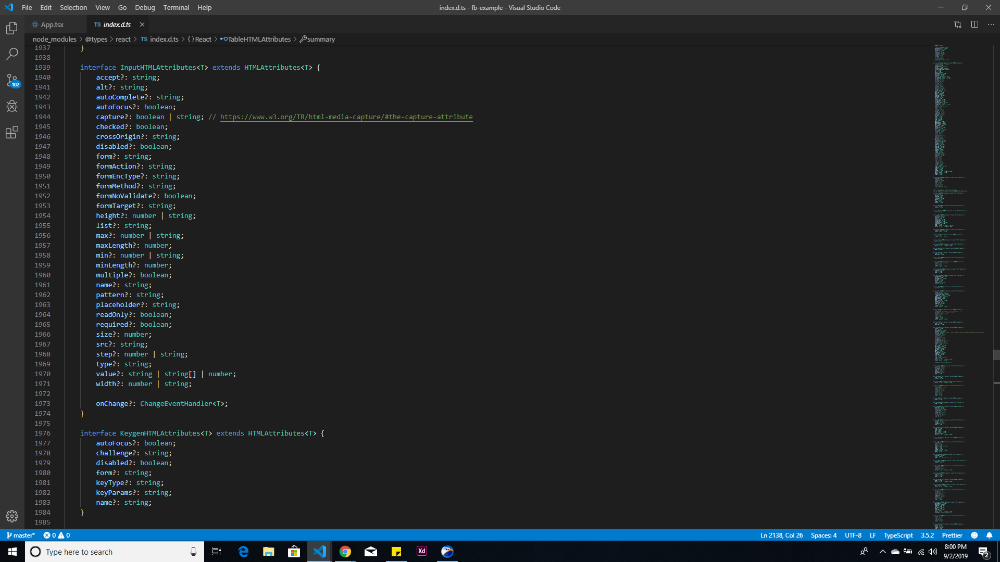

## Day 8

### What I worked on

Today is a great day. It was as if everything came together today.
I worked on a [codelab](https://reactjs.org/docs/thinking-in-react.html) from the official ReactJs documentation. It was a basic table sorting exercise that showed core patterns in React's way of thinking.

Here's my [follow along](https://github.com/vickOnRails/thinking-in-react-codelab). Yea. I know. It's ugly.

### A few challenges

The challenges I faced today were all related to passing `state` around. While I kinda get how the unidirectional data flow in React works, I still fall into traps that take hours to escape.

Hopefully this gets better over time.

### What I learned

I learned a whole lot of new things today.

- When passing a method to a child component, use the ES6 functions to declare the component. If you don't, calling `this.setState` in the method will return `undefined`. For example

```jsx
//Suppose we are in App.js
closeModal(){
    this.setState({openModal: ''});
}

<ApplyForm close={this.closeModal}/>

//In ApplyForm
<CloseModalButton onClick={props.close}/>

```

This will return `undefined`, because `this.setState({openModal: ''})` is called in the context of `<ApplyForm/>` and not in `App.js` it is defined and available.

We can solve this through binding `this` to the `App.js`, so `this.setState` always refers to our original state stored in `App.js`.

```js
<ApplyForm close={this.closeModal.bind(this)} />
```

Another place to bind `this` is in the class definition.

```js
class App extends Component {
  constructor(props) {
    state = {};

    this.closeModal = this.closeModal.bind(this);
  }
}
```

This way, we don't need to bind `this` anymore when passing it as `props`.

We could further make life easier by defining the methods as ES6 (arrow) functions. This way, `this` is always bound to where `state` is present and we don't need to bind it anymore.

```js
closeModal = () => {
  this.setState({ openModal: "" });
};
```

#### Typings in React

- I've also been frustrated by the typings in react. Today, I dabbled into the `@types/react/index.d.ts` file in the `node_modules` folder of a react-typescript project.

From my previous learnings, `d.ts` files are definition files. They basically define custom types for other `.js`, etc. programs. When I opened the file, I found all type definitions.



I plan to spend some time in this file, get to know them and understand why Typescript is so frustrating.

Something I also thought was cool today.

I was reading about conditional rendering from [Conditional Rendering in React](https://www.robinwieruch.de/conditional-rendering-react) and Robin introduced a pattern.

Think of a way to componentize loading bars. We could declare a single `<loader/>` component and pass `true` or `false` to it and based on that, render a loader or the loaded content.

```js
function LoadingIndicator({ isLoading }) {
  return <div>{isLoading ? <p>Loading...</p> : null}</div>;
}
```

To go more deeper, we could also make use of logical operators.

```js
function LoadingIndicator({ isLoading }) {
  return <div>{isLoading && <p>Hello World</p>}</div>;
}
```

This is possible because in JavaScript,

```js
const result = false && "Hello World";
```

`result` will be `Hello World` because a string is `true` in JavaScript.

- I also learned about Higher order. They are components that take a component as argument and return an enhanced version of the component.

We can have higher order functions that do a bunch of things like conditional rendering e.g returning a loading screen when data is not available and a component when data becomes available.

We could normally do this without higher order components, but I like the idea of just calling a single component that encapsulates every other thing.

More about Higher Order Components [here](https://www.robinwieruch.de/gentle-introduction-higher-order-components)

Have a great day and checkout [day 7](https://github.com/vickOnRails/100-days-of-react/tree/master/week1#day-7).

---

## Day 9

### What I worked on

A Tic Tac Toe Code Lab from the [official docs](https://reactjs.org/tutorial/tutorial.html). You can see a working demo [here](https://ticky-tac-toe.netlify.com/)

### What Challenges I faced

I spent several hours debugging a routes in a `react-router` app today. Most of my problems came from nested routes.

### What I learned

I solved them by putting the `exact` keywords in the right places. Take for example, this block of code

**NB:** `Router`, `Switch` and `Route` are all imported from `react-router-dom`.

```js
<Router>
  <Switch>
    <Route exact path="/" component={Home} />
    <Route exact path="/pages" component={Pages} />
  </Switch>
</Router>
```

If I wanted to add tabs to `Pages` I could add another `Route` inside the `Pages` component lik so...

```js
//In the Pages component
<Route path="/pages" component={Tab1} />
<Route path={this.props.match.url + "/tab2"} component={Tab2} />
<Route path={this.props.match.url + "/tab3"} component={Tab3} />
```

The tab routes will not work because `exact` in the parent `Route` will ensure everything that begins with `/pages` to return the `Pages` component. We can solve this by taking away the `exact` property. When we do this, all nested components can now render, except the `Pages` component will also render.

```js
<Route path="/pages" component={Pages} />
```

We can ultimately solve this by adding the `exact` keyword to the first `Route` like so

```js
<Route exact path="/pages" component={Tab1} />
```

This will ensure the `Tabs` component show only when we're on the `/pages` tab.

Have a great day and checkout [day 8](https://github.com/vickOnRails/100-days-of-react/tree/master/week2#day-8).

## Day 10

### What I worked on

I completed the routes for the [Purple Blog](https://purple-blog.netlify.com).

### What Challenges I faced

Nothing challenging today

### What I learned

I read the official react docs. More about lifting the `state` to coommon components above the screen.
Have a great day and checkout [day 9](https://github.com/vickOnRails/100-days-of-react/tree/master/week2#day-9).
